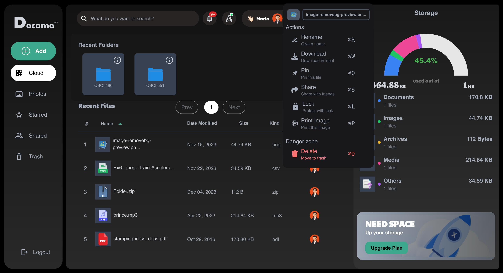
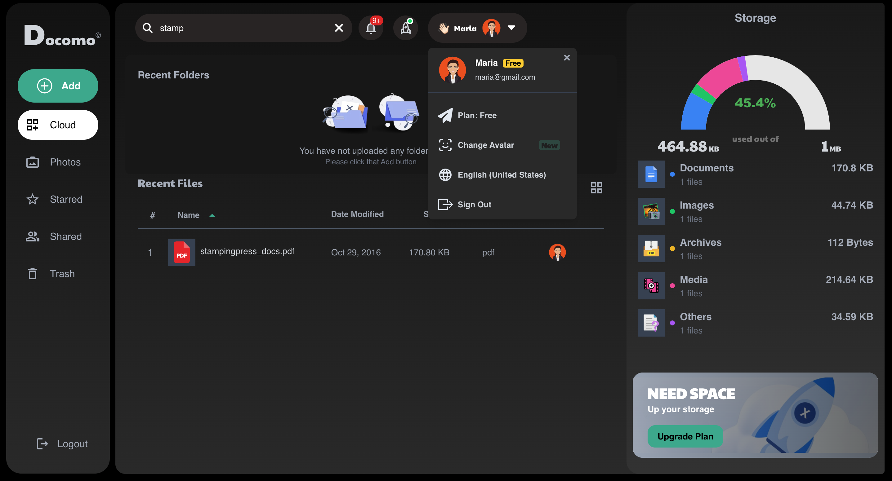
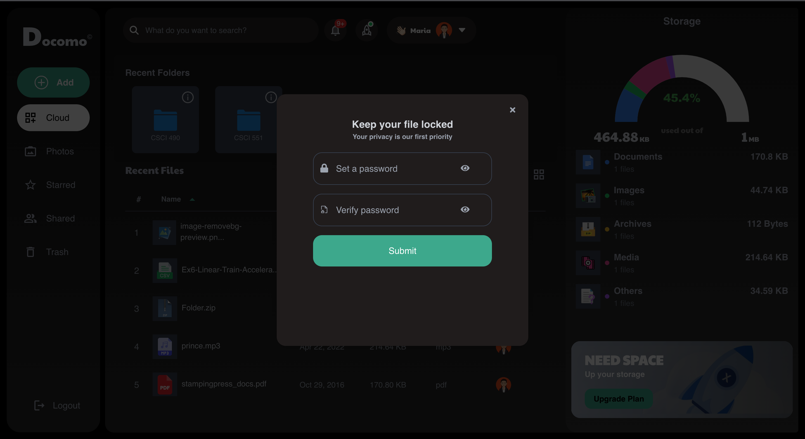
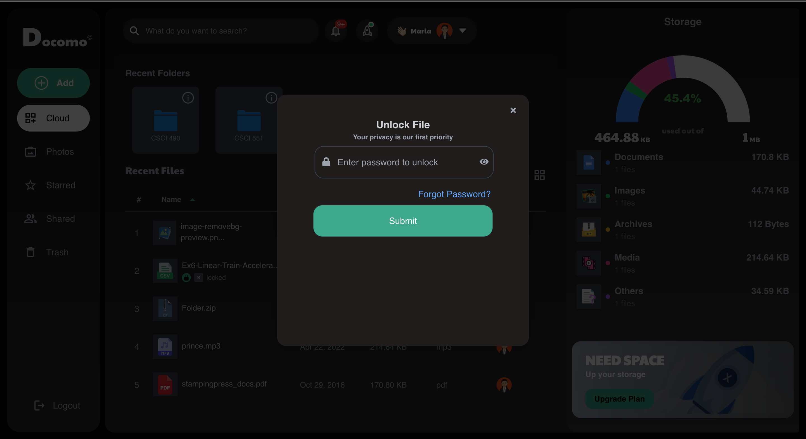
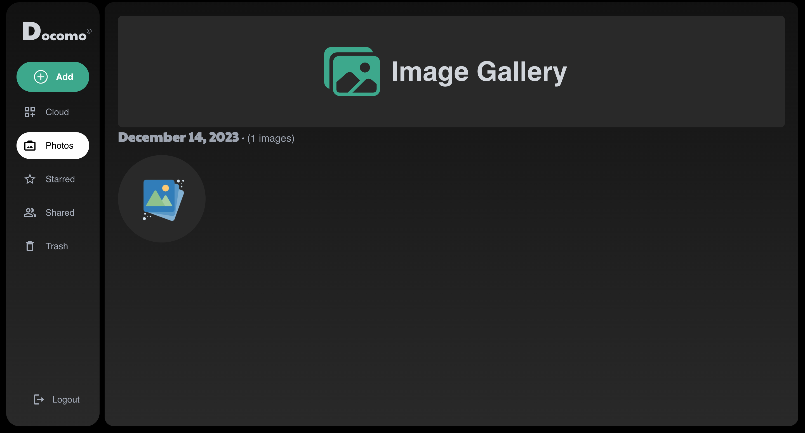

# Personal File Manager Website

## About Me
### Amritvir Randhawa
- **Role:** Full-Stack Developer, Mobile developer
- **Skills:** Next.js, React, Firebase, TailwindCSS, NextAuth, Dart, Django, Python, HTML, CSS, Javascript
- **Education:** Graduate (California State University of Chico Fall 2021 - Fall 2023)
- **Contact:** amritvirrandhawa@gmail.com
- **GitHub:** [https://github.com/clevereverdev](https://github.com/clevereverdev)
- 
## Project Overview
The Personal File Manager is a web-based application designed to help users manage their school and personal documents efficiently. Built with Next.js, React, Firebase, TailwindCSS, and NextAuth, this platform offers a user-friendly interface and advanced features for document management.

## Features
- **User Authentication:** Registration with email/password or Google Account, email verification, and secure login.
- **Document Management:** Upload, organize, and manage various document formats. Create, modify, and delete folders and documents.
- **Document Expiry Tracking:** Set and track expiration dates for personal documents, with automatic notifications.
- **Search Functionality:** Search for files by name or keywords.
- **Advanced Security:** Robust security measures to protect user documents, with password-protected user accounts.

## Technologies Used
- **Frontend:** Next.js, React
- **Authentication:** NextAuth
- **Backend and Database:** Firebase
- **Styling:** TailwindCSS

## Project User Interface








## Download Project

For a complete copy of the project, download the ZIP file:

[Download Project ZIP](https://github.com/clevereverdev/Documo/archive/refs/heads/main.zip)


## Installation and Setup
## Getting Started

First, run the development server:

```bash
npm run dev
# or
yarn dev
# or
pnpm dev
```

Open [http://localhost:3000](http://localhost:3000) with your browser to see the result.

You can start editing the page by modifying `app/page.js`. The page auto-updates as you edit the file.

This project uses [`next/font`](https://nextjs.org/docs/basic-features/font-optimization) to automatically optimize and load Inter, a custom Google Font.

